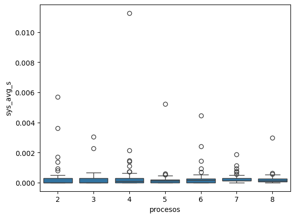
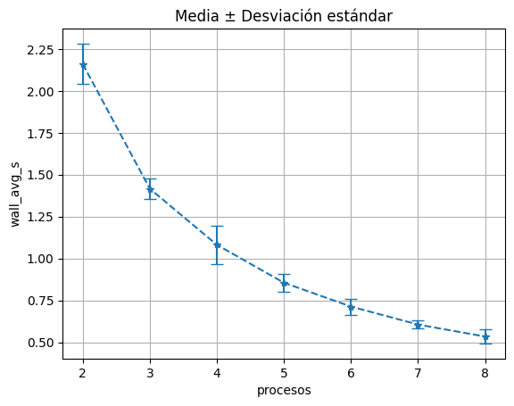

# ParalelPokeSearch
Repository to High Performance Computing project

## Contactos

Ariel Rodolfo Zarmudio Romero- zamromxd@gmail.com 

## Descripción
Implementacion en c con MPI del algoritmo de *PokeSearch*.

PokeSearch usa un algoritmo de ponderacion de pokemon que dado un pokemon retorna 6 pokemon similares: 3 pokemon contra los que tiene ventaja y otros 3 contra los que tiene desventaja.


La meta original del projecto era paralelizar este algoritmo pasandole a cada nodo la informacion del pokemon principal y otro para que cada uno haga la ponderacion y la retorne al nodo maestro y este haga el ordenamiento para retornar los 3 mejores y 3 peores.

Pero se observo que el algoritmo al ser muy sencillo no habia mejora e incluso podia empeorar el rendimiento, asi que se opto por paralelizar iteraciones para ver como mejoraba el rendimiento.


## Fuente de datos

Los datos provienen del repositorio [PokeSearch](https://github.com/ZamRom/PokeSearch). Los datos estan en un CSV que la primer columna es el nombre, las siguientes 2 son los tipos del pokemon, las siguientes 4 son las estadisticas relacionadas al ataque y defensa, la 7ma es la sumatoria de todas las estadisticas y las ultimas 54 son conteos de tipos de movimientos de cada tipo. 

## Procedimiento

La paralelización distribuye las iteraciones (indices aleatorios) entre los procesos MPI disponibles. Cada proceso trabaja de forma independiente sobre su subconjunto de pokemon y el nodo maestro recolecta y reporta las métricas al final de cada ronda.

## Estructura del proyecto

```
.
├── pokemon_mpi.c   # Algoritmo principal + lógica MPI
├── Timming.h       # Header para medición de tiempos (uswtime)
├── Timming.c       # Implementación de uswtime (wall, user, sys)
└── pokemon.csv     # Dataset de Pokémon (incluido en el repo)
```

## Requisitos

- MPI (OpenMPI o MPICH)
- GCC
- Cluster con SSH sin contraseña entre nodos (para ejecución distribuida)

## Compilación

```bash
mpicc -O2 -o pokemon_mpi pokemon_mpi.c Timming.c -lm
```

## Uso

```bash
mpirun -np <procesos> --hostfile hostfile.txt \
    ./pokemon_mpi <pokemon.csv> <iter_por_ronda> <num_rondas> <output.csv>
```

Ejemplo con 8 procesos, 10 000 iteraciones y 5 rondas:

```bash
mpirun -np 8 --hostfile hostfile.txt \
    ./pokemon_mpi pokemon.csv 10000 5 metricas.csv
```

## Métricas de salida

Al terminar cada ronda se imprime en consola y se escribe una fila en el CSV:

```
[ronda 1/5]
  Benchmarks (seg):
  real  max=1.243  min=1.181  avg=1.210
  user  max=1.198  min=1.143  avg=1.172
  sys   max=0.021  min=0.008  avg=0.014
  CPU/Wall avg = 97.812 %
```

Columnas del CSV de salida:

```
procesos, 
wall_max_s, wall_min_s, wall_avg_s,
user_max_s, user_min_s, user_avg_s,
sys_max_s,  sys_min_s,  sys_avg_s,
cpu_wall_pct_avg
```

- **real (wall)**: tiempo de reloj de pared — el más relevante para comparar speedup
- **user**: tiempo de CPU en espacio de usuario
- **sys**: tiempo de CPU en llamadas al kernel
- **CPU/Wall %**: qué porcentaje del tiempo de pared fue trabajo real de CPU;

## Infraestructura utilizada

Probado sobre un cluster de 8 instancias EC2.


## Resultados

Se ejecutaron 100 rondas con 10000 iteraciones con los procedimientos del rango \[2,8] y se hicieron los resultados descritos en el archivo CSV [metricas.csv](./metricas.csv).

Se planeaba graficar en un mismo plot las comparativas de tiempo de usuario, sistema y real contra los procesos (nodos), pero se observo que por la naturaleza del problema, los tiempos de sistema eran indiferentes a la cantidad de procesos. Por que? Porque el problema es CPU-bound (puras operaciones aritmeticas con flotantes sobre datos en memoria).



Dado que tenemos este tema, se concluyo que era visualmente mas claro solo graficar el promedio del tiempo real con la diferencia de la desviacion estandar.



## Créditos

- Algoritmo original en Python: [Rodolfo Zamudio (ZamRom)](https://github.com/ZamRom) 
- Utilidad de medición de tiempos (`Timming.h` / `Timming.c`):
  [Victor de la Luz (Itztli)](https://github.com/itztli) —
  disponible en [hpcvdelaluz2026](https://github.com/itztli/hpcvdelaluz2026)